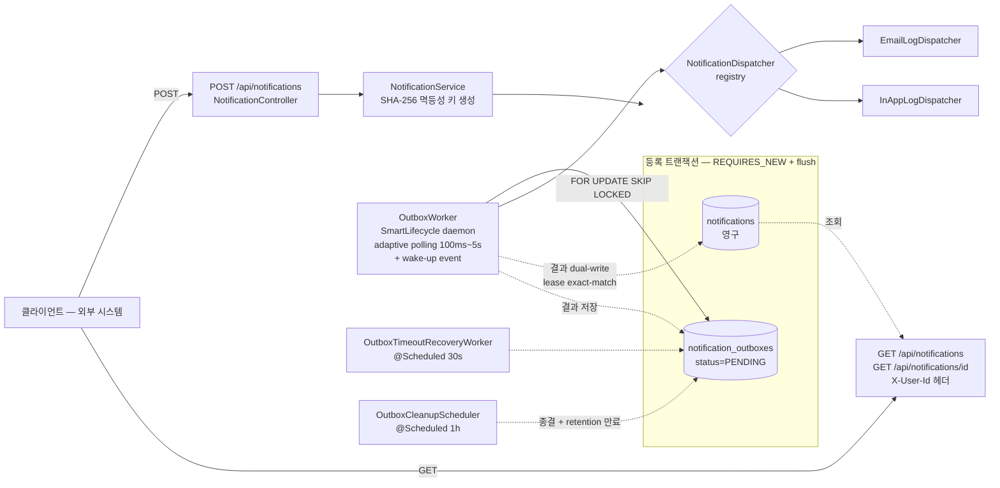
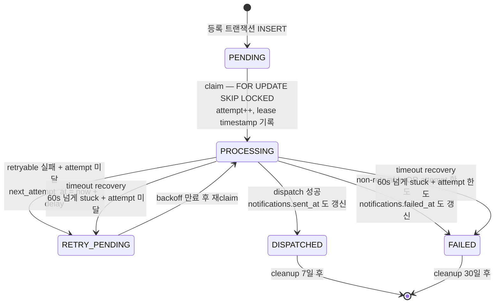
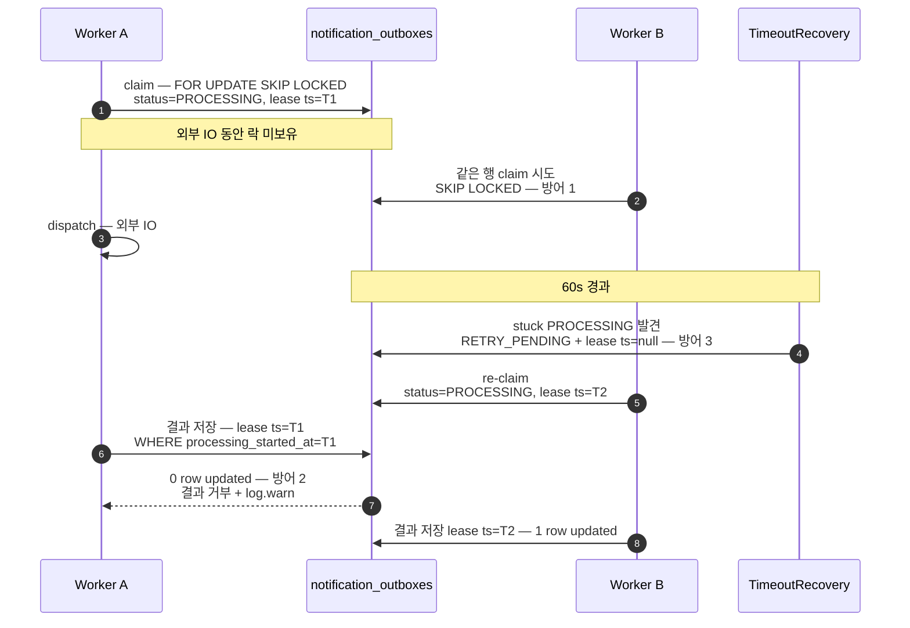

# notifier — 알림 발송 시스템

본 저장소는 [`docs/과제C_알림발송시스템.md`](docs/과제C_알림발송시스템.md) 의 *알림 발송 시스템* 구현이다. 수강 신청 / 결제 / 강의 시작 1일 전 같은 도메인 이벤트를 받아 이메일·인앱 알림을 비동기로 발송한다. 메시지 브로커를 사용하지 않으며, DB outbox 패턴으로 비동기 발송·멱등성·다중 인스턴스 안전성을 모두 만족한다.

---

## 프로젝트 개요

### 구현 범위 — 명세 필수 요구사항 5종 모두 구현 완료

| # | 요구 | 본 시스템의 답 |
| --- | --- | --- |
| 1 | API — 알림 등록 / 단건 조회 / 본인 알림 목록 (읽음·안 읽음 필터) | `POST /api/notifications`, `GET /api/notifications/{id}`, `GET /api/notifications?read=&limit=` |
| 2 | 상태 전이 명시 | outbox 5상태 (`PENDING → PROCESSING → DISPATCHED / RETRY_PENDING / FAILED`) |
| 3 | 재시도 + 최종 실패 | `RetryExceptionClassifier` + 지수백오프 (max 5 / base 5s / max 5min / ±20% jitter) + `failure_reason` 기록 |
| 4 | 멱등성 (동시 race 포함) | 5요소 SHA-256 → `idempotency_key` UNIQUE + try saveNew + catch + `DuplicateKeyDetector` |
| 5 | 처리 중 복구 / 재시작 시 유실 X / 다중 인스턴스 중복 X | `OutboxTimeoutRecoveryWorker` (60s timeout) + DB outbox 본체로 재시작 자연 회복 + `FOR UPDATE SKIP LOCKED` + lease exact-match |

### 추가로 구현한 항목

| 항목 | 내용 |
| --- | --- |
| 더미 데이터 자동 적재 | `demo` 프로필 활성 시 [`db/demo/data.sql`](src/main/resources/db/demo/data.sql) 가 5건 (SENT 읽음 / SENT 안 읽음 / FAILED / PENDING / 다른 사용자) 적재 |
| 다중 인스턴스 시연 환경 | `docker compose up --scale app=2` 로 두 워커가 같은 MySQL 공유. 호스트 포트 range 매핑 (`8080-8089:8080`) 으로 자동 배분 |
| Adaptive polling + wake-up event | 100ms–5s 지수 backoff + 등록 commit 직후 `ApplicationEventPublisher` 가 워커 즉시 깨움 |
| `@ConfigurationProperties` 외부화 | 모든 outbox 수치 (`outbox.worker.*` / `outbox.retry.*` / `outbox.recovery.*` / `outbox.cleanup.*`) 를 `application.yaml` 로 분리 |

### 시스템 구성도



### 핵심 결정 요약

| # | 결정 | 근거 / 상세 |
| --- | --- | --- |
| 1 | DB outbox + claim-lease 패턴 | 메시지 브로커 미사용 제약 안에서 운영 환경 전환 가능한 구조 확보. [`docs/architecture.md`](docs/architecture.md) 1장 |
| 2 | 두 테이블 책임 분리 | `notifications` (사용자 가시·영구) + `notification_outboxes` (워커 큐·휘발). [`docs/architecture.md`](docs/architecture.md) 2장 |
| 3 | 사용자 가시 status 컬럼 미보유 | `sent_at` / `failed_at` 두 timestamp 로 derive. invariant 위반 차단 |
| 4 | try saveNew + catch DataIntegrityViolationException | DB UNIQUE 제약을 race 결정자로 사용. [`docs/reason2.md`](docs/reason2.md) |
| 5 | 4중 동시성 방어 | SKIP LOCKED + lease exact-match + timeout recovery + retention cleanup. [`docs/architecture.md`](docs/architecture.md) 5장 |

### 추가 제출물 위치

| 추가 제출물 | 위치 |
| --- | --- |
| 1. 비동기 처리 구조 및 재시도 정책 (ERD / DDL 포함) | [`docs/architecture.md`](docs/architecture.md) |
| 2. 요구사항 해석 | [`docs/requirements-and-improvements.md`](docs/requirements-and-improvements.md) |

---

## 기술 스택

| 항목 | 선택 | 근거 |
| --- | --- | --- |
| 프레임워크 | Spring Boot 4.0.6 / Java 21 | 명세의 *"Spring Boot 기반"* 제약 충족 |
| ORM | JPA (Hibernate 7) | 명세의 *"JPA 사용"* 제약 충족. claim-lease 만 native query, 그 외는 JPQL |
| DB (운영) | MySQL 8.4 | 명세의 *"H2 / MySQL / PostgreSQL 중 선택"* 중 채택. `FOR UPDATE SKIP LOCKED` 안정 지원 |
| DB (테스트) | H2 2.x in-memory (`MODE=MySQL`) | 운영 SQL 호환 유지하면서 통합 테스트 가속 |
| 빌드 | Gradle (Groovy `build.gradle`) | 템플릿 유지 |
| 인증 | `X-User-Id` 헤더 (`@RequestHeader`) | 명세의 *"userId 를 헤더나 파라미터로 전달하는 방식도 허용"* 제약 |
| 라이브러리 | Lombok (`@Slf4j`, `@RequiredArgsConstructor`, `@Getter`) | 보일러플레이트 감소 |
| 인프라 | Docker / Docker Compose | clone 후 한 줄 실행 |

명세 제약 (Spring Boot · JPA · DB 선택지 · 인증 간략화 · 실제 발송 불필요 · 브로커 미설치) 을 모두 준수한다.

---

## 실행 방법

### 사전 요구

| 항목 | 값 |
| --- | --- |
| 컨테이너 런타임 | Docker Desktop 또는 호환 런타임 |
| 호스트 포트 | 3306 (MySQL), 8080–8089 (앱 — range 매핑) |

### 단일 인스턴스 실행 (더미 데이터 자동 적재)

```bash
git clone <repo>
cd notifier
docker compose up -d --build
docker compose logs -f app
```

부팅 완료 (~2초) 시 로그:

```
notifier-app-1  | The following 2 profiles are active: "local", "demo"
notifier-app-1  | OutboxWorker 시작 — auto-start=true
notifier-app-1  | Started NotifierApplication in 2.0 seconds
```

`demo` 프로필이 활성화되면 [`src/main/resources/db/demo/data.sql`](src/main/resources/db/demo/data.sql) 가 더미 데이터 5건을 적재한다.

| id | 사용자 | 채널 | 타입 | 상태 | read_at | 용도 |
| --- | --- | --- | --- | --- | --- | --- |
| 1 | 1 | IN_APP | ENROLLMENT_COMPLETED | SENT | 있음 | 발송 완료 + 읽음 |
| 2 | 1 | IN_APP | PAYMENT_CONFIRMED | SENT | 없음 | 발송 완료 + 안 읽음 |
| 3 | 1 | EMAIL | ENROLLMENT_COMPLETED | FAILED | – | 실패 사유 기록 |
| 4 | 1 | IN_APP | COURSE_START_D1 | PENDING | – | sent_at / failed_at 모두 NULL |
| 5 | 2 | IN_APP | ENROLLMENT_COMPLETED | SENT | 없음 | 다른 사용자 격리 검증 |

더미 데이터는 `notifications` 테이블에만 적재되며 *조회·필터 API 시연용* 이다. 실제 워커 동작은 POST 로 신규 알림을 등록한 뒤 확인한다.

### 다중 인스턴스 시연

명세 필수 5번의 *"다중 인스턴스 환경에서 동일 알림이 중복 처리되어서는 안 됩니다"* 검증 절차.

```bash
docker compose down -v
docker compose up --scale app=2 -d --build
docker compose logs -f app
```

`app-1` 은 호스트 8080, `app-2` 는 8081 에 매핑되며 동일 MySQL 을 공유한다.

검증 명령:

```bash
for i in $(seq 1 20); do
  curl -s -X POST http://localhost:8080/api/notifications \
    -H 'Content-Type: application/json' \
    -d "{\"receiverId\":1,\"type\":\"ENROLLMENT_COMPLETED\",\"channel\":\"EMAIL\",\"refType\":\"BATCH\",\"refId\":$i}" > /dev/null
done

docker compose logs app 2>&1 | grep -E '\[EMAIL\]|\[IN_APP\]' \
  | grep -oE 'outboxId=[0-9]+' | sort | uniq -d
```

위 명령의 출력이 비어 있으면 중복 dispatch 가 발생하지 않은 것이다. 실제 시연 로그는 [`docs/architecture.md`](docs/architecture.md) 9장 참조.

### IDE 직접 실행

MySQL 만 컨테이너로 띄운다.

```bash
docker compose up -d mysql
```

IDE Run Configuration 환경변수:

```
SPRING_PROFILES_ACTIVE=local
DB_URL=jdbc:mysql://localhost:3306/notifier?useSSL=false&serverTimezone=Asia/Seoul&allowPublicKeyRetrieval=true&characterEncoding=UTF-8
DB_USERNAME=notifier
DB_PASSWORD=notifier
```

`demo` 프로필 미활성 상태로 부팅하므로 더미 데이터는 적재되지 않는다.

### 종료

| 명령 | 동작 |
| --- | --- |
| `docker compose down` | 컨테이너 정지. DB 볼륨 유지 |
| `docker compose down -v` | 컨테이너 정지 + DB 볼륨 삭제. 다음 부팅 시 더미 5건 재적재 |

### 호스트 포트 충돌

```bash
MYSQL_HOST_PORT=3307 docker compose up -d
```

앱 포트는 `docker-compose.yml` 의 `"8080-8089:8080"` range 매핑이라 자동으로 다음 가용 포트를 사용한다.

---

## API 목록 및 예시

3 엔드포인트를 제공한다. 조회 API 는 `X-User-Id` 헤더가 필수다. PATCH `/{id}/read` 는 명세 선택 구현 3번 영역으로 분류해 미구현이며, 사유는 *미구현 / 제약사항* 에서 다룬다.

### POST /api/notifications — 알림 등록

요청:

```bash
curl -i -X POST http://localhost:8080/api/notifications \
  -H 'Content-Type: application/json' \
  -d '{
    "receiverId": 1,
    "type": "ENROLLMENT_COMPLETED",
    "channel": "EMAIL",
    "refType": "ENROLLMENT",
    "refId": 1001
  }'
```

| 필드 | 타입 | 제약 |
| --- | --- | --- |
| `receiverId` | Long | not null, positive |
| `type` | enum | `ENROLLMENT_COMPLETED` / `PAYMENT_CONFIRMED` / `COURSE_START_D1` / `ENROLLMENT_CANCELLED` |
| `channel` | enum | `EMAIL` / `IN_APP` |
| `refType` | String | not blank, max 64자 |
| `refId` | Long | not null, positive |

본문 (`body`) 은 서버가 `NotificationMessageRenderer` 로 type 별 고정 메시지를 렌더한다. 클라이언트가 전달하지 않는다.

응답:

| 상태 | 의미 | 응답 본문 |
| --- | --- | --- |
| 202 Accepted | 신규 등록 | `{"id": 6}` |
| 200 OK | 같은 5요소 재호출 (silent dedup) | `{"id": 6}` — 신규 응답과 동일한 id |

응답 본문은 두 경우 동일하다. 클라이언트는 신규/중복을 구분할 필요가 없다. 멱등성 키는 서버가 `SHA-256(receiverId│type│refType│refId│channel)` 64자 hex 로 생성한다.

검증 실패 (400 Bad Request):

```http
HTTP/1.1 400 Bad Request
{"errorCode":"INVALID_INPUT","message":"수신자 ID 는 비어 있을 수 없습니다."}
```

| 위반 | 메시지 |
| --- | --- |
| `receiverId` null | 수신자 ID 는 비어 있을 수 없습니다. |
| `receiverId` ≤ 0 | 수신자 ID 는 양수여야 합니다. |
| `type` null / 허용값 외 | 알림 타입은 비어 있을 수 없습니다. |
| `channel` null | 발송 채널은 비어 있을 수 없습니다. |
| `refType` blank | 참조 타입은 비어 있을 수 없습니다. |
| `refType` 길이 > 64 | 참조 타입은 64자를 넘을 수 없습니다. |

### GET /api/notifications/{id} — 단건 조회

요청:

```bash
curl -s http://localhost:8080/api/notifications/1 -H 'X-User-Id: 1' | jq
```

응답 (200 OK):

```json
{
  "id": 1,
  "type": "ENROLLMENT_COMPLETED",
  "channel": "IN_APP",
  "refType": "ENROLLMENT",
  "refId": 1001,
  "body": "수강 신청이 완료되었습니다.",
  "status": "SENT",
  "sentAt": "2026-05-10T11:00:00",
  "failedAt": null,
  "failureReason": null,
  "readAt": "2026-05-10T12:00:00",
  "createdAt": "2026-05-10T10:00:00"
}
```

`status` 는 응답 DTO ([`NotificationResponse.deriveStatus`](src/main/java/com/hyso/notifier/presentation/notification/dto/response/NotificationResponse.java)) 가 두 timestamp 로 산출한다.

| 조건 | status |
| --- | --- |
| `sentAt != null` | `SENT` |
| `failedAt != null` | `FAILED` |
| 그 외 | `PENDING` |

워커 입장의 `RETRY_PENDING` 은 사용자 관점에서 `PENDING` 과 동일하게 노출된다.

오류 응답:

| 상태 | errorCode | 조건 | 메시지 |
| --- | --- | --- | --- |
| 404 Not Found | NOTIFICATION_NOT_FOUND | 비소유 / 비존재 (둘 다 같은 응답) | 알림을 찾을 수 없습니다. |
| 400 Bad Request | INVALID_INPUT | `X-User-Id` 헤더 누락 | 사용자 식별 헤더가 비어 있을 수 없습니다. |
| 400 Bad Request | INVALID_INPUT | `X-User-Id` 형식 오류 (숫자 아님) | 요청 값의 형식이 올바르지 않습니다. |

비소유와 비존재를 동일한 404 응답으로 통합한 이유는 *id 가 어떤 사용자 소유인지* 의 정보 누설을 차단하기 위함이다.

### GET /api/notifications — 목록 조회

쿼리 파라미터:

| 파라미터 | 타입 | 기본값 | 제약 |
| --- | --- | --- | --- |
| `read` | Boolean | 미지정 → 전체 | `true` / `false` |
| `limit` | int | 20 | 1 ≤ limit ≤ 100 |

요청:

```bash
curl -s 'http://localhost:8080/api/notifications?read=false&limit=10' -H 'X-User-Id: 1' | jq
curl -s 'http://localhost:8080/api/notifications?read=true'           -H 'X-User-Id: 1' | jq
curl -s 'http://localhost:8080/api/notifications'                     -H 'X-User-Id: 1' | jq
```

응답 (200 OK):

```json
{
  "items": [
    { "id": 4, "type": "COURSE_START_D1",      "status": "PENDING", "readAt": null, "...": "..." },
    { "id": 3, "type": "ENROLLMENT_COMPLETED", "status": "FAILED",  "failureReason": "max attempts exceeded: ...", "...": "..." },
    { "id": 2, "type": "PAYMENT_CONFIRMED",    "status": "SENT",    "readAt": null, "...": "..." }
  ]
}
```

| 항목 | 규칙 |
| --- | --- |
| 정렬 | `created_at DESC, id DESC` (최신순) |
| 격리 | `WHERE receiver_id = :userId` 로 본인 자원만 |
| `receiverId` 미노출 | 사용자가 `X-User-Id` 로 자기 자신을 알고 있음 |

검증 실패 (400 Bad Request):

| 위반 | 메시지 |
| --- | --- |
| `limit < 1` | limit 은 1 이상이어야 합니다. |
| `limit > 100` | limit 은 100 을 넘을 수 없습니다. |

---

## 데이터 모델 설명

테이블은 두 개다. ERD 와 전체 DDL 은 [`docs/architecture.md`](docs/architecture.md) 2장 참조.

### 두 테이블의 책임 분리

| 측면 | `notifications` | `notification_outboxes` |
| --- | --- | --- |
| 역할 | 사용자 가시 + 영구 결과 store | 워커 큐 + 라이프사이클 메타 |
| 보존 | 영구 (cleanup 대상 아님) | 종결 후 retention 만료 시 cleanup |
| status 표현 | timestamp 로 derive (SENT/FAILED/PENDING) | 명시적 status 컬럼 (5개) |
| 결과 필드 | 영구 (`sent_at` / `failed_at` / `failure_reason`) | 휘발 (`dispatched_at` / `failed_at` / `failure_reason`) |
| 갱신 시점 | 최종 결과만 (DISPATCHED / FAILED 종결 시점) | 모든 status 전이 |

결과 필드는 양쪽이 동시에 보유한다. 한 결과 저장 트랜잭션 ([`OutboxResultPersister.persist`](src/main/java/com/hyso/notifier/application/notification/outbox/OutboxResultPersister.java)) 안에서 dual-write 한다. `notifications` 는 최종만 반영하므로 RETRY_PENDING 동안 사용자에게 "처리 중" 으로 일관되게 보인다.

### 컬럼 요지

`notifications` (사용자 가시):

| 컬럼 | 타입 | 비고 |
| --- | --- | --- |
| `id` | BIGINT PK | AUTO_INCREMENT |
| `receiver_id` | BIGINT | 수신자 |
| `type`, `channel` | enum | `ENROLLMENT_COMPLETED` / `PAYMENT_CONFIRMED` / `COURSE_START_D1` / `ENROLLMENT_CANCELLED`, `EMAIL` / `IN_APP` |
| `ref_type`, `ref_id` | VARCHAR(64), BIGINT | 참조 자원 |
| `body` | VARCHAR(500) | 서버가 type 별로 렌더한 메시지 |
| `idempotency_key` | VARCHAR(64) UNIQUE | SHA-256 hex 64자 |
| `sent_at`, `failed_at`, `failure_reason`, `read_at` | nullable | 사용자 가시 status 의 원천 |
| `created_at` | TIMESTAMP | 생성 시각 |

`notification_outboxes` (워커 메타):

| 컬럼 | 타입 | 비고 |
| --- | --- | --- |
| `id` | BIGINT PK | |
| `notification_id` | BIGINT UNIQUE | 1:1 매핑 |
| `idempotency_key` | VARCHAR(64) UNIQUE | notifications 와 동일 키 |
| `status` | enum | `PENDING` / `PROCESSING` / `DISPATCHED` / `RETRY_PENDING` / `FAILED` |
| `processing_attempt` | INT | claim 시 증가 |
| `processing_lease_state` | enum | `IDLE` / `CLAIMED` |
| `processing_started_at` | TIMESTAMP | lease timestamp (exact-match 핵심) |
| `next_attempt_at` | TIMESTAMP nullable | 재시도 백오프 시각 |
| `receiver_id`, `channel`, `body` | dispatch 스냅샷 | notifications 와 join 불필요 |
| `dispatched_at`, `failed_at`, `failure_reason` | 휘발 결과 필드 | retention 안 운영 디버깅용 |
| `created_at`, `updated_at` | TIMESTAMP | |

### 보존 정책

| 테이블 / status | retention | 비고 |
| --- | --- | --- |
| `notifications` | 영구 | 사용자 조회 데이터 소스 |
| `notification_outboxes` (`DISPATCHED`) | 7 일 | 시연·단기 디버깅 |
| `notification_outboxes` (`FAILED`) | 30 일 | 사후 분석 여유 |

### outbox status 전이



ERD (mermaid `erDiagram`) + 전체 DDL + 인덱스 설계 근거는 [`docs/architecture.md`](docs/architecture.md) 2장 참조.

---

## 요구사항 해석 및 가정

상세는 [`docs/requirements-and-improvements.md`](docs/requirements-and-improvements.md) 에서 phase 별로 다룬다. 본 절은 핵심 가정만 정리한다.

| # | 가정 | 내용 |
| --- | --- | --- |
| 1 | "동일 이벤트" 의 정의 | `(receiverId, type, refType, refId, channel)` 5요소 SHA-256 hex 64자가 `idempotency_key`. 5요소가 같으면 같은 알림 |
| 2 | 단일 채널 (1요청 = 1채널) | 명세 `channel` 단수형 해석. EMAIL + IN_APP 둘 다 보내려면 두 번 POST |
| 3 | 인증 = `X-User-Id` 직접 사용 | `users` 테이블 / `User` 엔티티 미생성. 사용자 존재 검증 미수행. 게이트웨이 / auth 서비스에 위임 |
| 4 | 비소유 / 비존재 모두 404 | 정보 누설 방지. 403 미사용 |
| 5 | 사용자 가시 status = timestamp derive | `notifications` 에 status 컬럼 없음. 응답 DTO 가 산출 |
| 6 | `read_at` 갱신은 외부 책임 | PATCH `/{id}/read` 미구현. 명세의 *읽음/안 읽음 필터* 는 필터링만 요구로 해석 |
| 7 | inbox 패턴 미적용 | 본 API 가 *이미 정리된* 발송 요청을 받음. 외부 raw event 해석 단계가 없으므로 inbox 가치가 약함. 상세는 [`docs/reason.md`](docs/reason.md) |

---

## 설계 결정과 이유

### 1. DB outbox + claim-lease

명세의 *"실제 메시지 브로커 설치 불필요. 단, 실제 운영 환경으로 전환 가능한 구조"* 의 답이다. 큐 역할을 DB 테이블이 수행한다.

| 단계 | 동작 |
| --- | --- |
| 등록 | 비즈니스 INSERT + outbox INSERT 를 같은 트랜잭션에서 commit. 둘 중 하나만 들어가는 일이 없다 |
| claim | 워커가 `FOR UPDATE SKIP LOCKED` 로 polling-claim |
| dispatch | 별도 트랜잭션 + 락 미보유 단계에서 외부 IO 수행 |
| 결과 저장 | 별도 트랜잭션에서 lease exact-match 검증 후 dual-write |

운영 전환 시 [`NotificationDispatcher`](src/main/java/com/hyso/notifier/application/notification/outbox/dispatcher/NotificationDispatcher.java) 인터페이스를 SMTP / SQS / Kafka 어댑터로 교체한다. 도메인 로직이 broker 구현 디테일에 의존하지 않는다.

현재 구현체는 mock 두 개이다.

| 구현체 | 동작 |
| --- | --- |
| [`EmailLogDispatcher`](src/main/java/com/hyso/notifier/application/notification/outbox/dispatcher/EmailLogDispatcher.java) | `log.info("[EMAIL] outboxId={} receiver={} body={}", ...)` |
| [`InAppLogDispatcher`](src/main/java/com/hyso/notifier/application/notification/outbox/dispatcher/InAppLogDispatcher.java) | `log.info("[IN_APP] outboxId={} receiver={} body={}", ...)` |

### 2. 두 테이블 책임 분리

한 테이블에 status 와 워커 메타까지 모두 두면 다음 문제가 발생한다.

| 문제 | 영향 |
| --- | --- |
| retention cleanup 시 사용자 알림 목록 데이터까지 함께 사라짐 | 명세의 *"현재 상태 조회"* 위반 |
| 워커 lifecycle (claim / lease / attempt) 의 잦은 UPDATE 가 사용자 가시 자원에 섞임 | row contention |

따라서 두 테이블로 분리한다. 결과 필드는 양쪽 모두 보유하고 한 트랜잭션에서 dual-write 한다.

### 3. 사용자 가시 status 컬럼 미보유

별도 `status` 컬럼을 두면 invariant 위반 (예: `status=SENT` 인데 `sent_at=NULL`) 위험이 있다. timestamp 단일 진실 원천이 안전하다.

```java
// NotificationResponse.deriveStatus
if (sent_at != null)   → SENT
if (failed_at != null) → FAILED
else                   → PENDING
```

워커 입장의 `RETRY_PENDING` 은 사용자 관점에서 `PENDING` 과 동일하게 묶인다 (`sent_at` / `failed_at` 모두 NULL).

### 4. 멱등성 — try saveNew + catch DataIntegrityViolationException

race 의 결정자는 DB UNIQUE 제약이다. 자바 단의 try/catch 는 dedup 분기 역할만 한다.

```
INSERT 시도 (@Transactional(REQUIRES_NEW) + entityManager.flush())
  ├─ 성공 → 새 id 반환 (202 Accepted)
  └─ DataIntegrityViolationException
        ├─ DuplicateKeyDetector.isDuplicateKey == true
        │      → findByIdempotencyKey → 기존 id 반환 (200 OK, silent dedup)
        └─ 그 외 (NOT NULL / FK 등) → propagate → 500
```

| 메커니즘 | 역할 |
| --- | --- |
| `@Transactional(REQUIRES_NEW)` | 자식 트랜잭션 분리. UNIQUE 위반으로 자식이 rollback-only 마킹돼도 부모 catch 가능 |
| `entityManager.flush()` | JPA 기본 flush 시점이 commit 인 점을 우회. INSERT 를 메서드 안에서 발행해 같은 메서드 안에서 예외 잡힘 |
| `DuplicateKeyDetector` | MySQL (SQLState=23000 / ErrorCode=1062) + H2 (SQLState=23505) 호환. nested cause chain 탐색 |

대안 비교 (find-first / INSERT…ON DUPLICATE KEY UPDATE / 409 Conflict) 는 [`docs/reason2.md`](docs/reason2.md) 참조.

### 5. 4중 동시성 방어



| 방어 | 단계 | 메커니즘 |
| --- | --- | --- |
| 1. SKIP LOCKED | claim | 한 워커가 lock 잡은 행은 다른 워커가 건너뛴다. 동시 polling 해도 각자 다른 batch 를 잡는다 |
| 2. Lease exact-match | 결과 저장 | `WHERE id=? AND status='PROCESSING' AND processing_lease_state='CLAIMED' AND processing_started_at=:claimedTimestamp`. 다른 워커가 가로챘으면 timestamp 불일치로 0행 갱신 |
| 3. Timeout recovery | 백그라운드 | `OutboxTimeoutRecoveryWorker` (@Scheduled 30s) 가 `processing_started_at < now - 60s` 인 행을 RETRY_PENDING / FAILED 로 풀어준다. crash / GC pause / 네트워크 hang 자연 복구 |
| 4. Retention cleanup | 백그라운드 | 종결 후 DISPATCHED 7d / FAILED 30d 경과 시 outbox 삭제. `notifications` 본체는 영구 |

상세 코드 인용과 race 시나리오는 [`docs/architecture.md`](docs/architecture.md) 5장 참조.

### 6. 재시도 정책

[`RetryExceptionClassifier`](src/main/java/com/hyso/notifier/application/notification/outbox/RetryExceptionClassifier.java) 가 dispatcher 호출 시 발생한 예외를 분류한다.

| 예외 | 분류 | 결말 |
| --- | --- | --- |
| `IOException` | retryable | `RETRY_PENDING` + delay |
| `TimeoutException` | retryable | `RETRY_PENDING` + delay |
| `TransientFailureException` | retryable | `RETRY_PENDING` + delay |
| `IllegalArgumentException` | non-retryable | 즉시 `FAILED` |
| `IllegalStateException` | non-retryable | 즉시 `FAILED` |
| 기타 | non-retryable | 즉시 `FAILED` |

분기 규칙:

| 조건 | 결말 |
| --- | --- |
| non-retryable | 즉시 `FAILED` + `failure_reason` |
| retryable + attempt < 5 | `RETRY_PENDING` + `next_attempt_at = now + delay` |
| retryable + attempt ≥ 5 | `FAILED` + `failure_reason = "max attempts exceeded: ..."` |

`RetryBackoffCalculator` 의 공식: `delay = min(5s × 2^(attempt-1), 5min) × (1 ± 0.2)`

| attempt | base delay | jitter 적용 후 |
| --- | --- | --- |
| 1 | 5 s | ~4–6 s |
| 2 | 10 s | ~8–12 s |
| 3 | 20 s | ~16–24 s |
| 4 | 40 s | ~32–48 s |
| 5 | 80 s | ~64–96 s (또는 5min 캡) |

모든 수치는 `application.yaml` 의 `outbox.retry.*` 로 외부화돼 있다.

### 7. Adaptive Polling + Wake-up Event

고정 주기 polling 은 두 가지 문제를 일으킨다.

| 주기 | 문제 |
| --- | --- |
| 길다 | 작업 폭주 시 큐 적체 |
| 짧다 | 작업 부재 시 무의미한 DB 부하 |

본 시스템은 100ms–5s 구간 지수 backoff 를 적용한다.

| 상태 | 동작 |
| --- | --- |
| `HAS_WORK` | min (100ms) 로 reset |
| `IDLE` | 다음 주기를 2배수로 늘림. ±20% jitter 로 다중 인스턴스 동시 깨어남 방지 |

추가로 등록 commit 직후 `ApplicationEventPublisher` 가 `OutboxRowAvailableEvent` 를 발행하면 `@TransactionalEventListener(phase=AFTER_COMMIT)` 가 워커를 즉시 깨운다. 등록부터 dispatch 시작까지의 latency 가 평균 100ms 이내로 유지된다.

Spring `ApplicationEventPublisher` 는 in-process 이벤트만 전달하므로 wake-up 은 본인 프로세스 내부 워커만 깨운다. 다른 인스턴스의 워커는 polling 으로 자연 처리한다.

### 8. inbox 패턴 미적용

본 시스템의 등록 API 는 *이미 정리된* 발송 요청을 받는다 (`receiver_id` / `type` / `channel` 을 클라이언트가 결정해 전달). 외부 원본 이벤트를 *해석* 하는 단계가 없으므로 inbox 의 본질적 가치 (원본 이벤트 내부화 + 해석 실패 격리) 가 약하다.

상세 비교는 [`docs/reason.md`](docs/reason.md) 참조.

---

## 테스트 실행 방법

```bash
./gradlew test
```

H2 in-memory 기반이며 `profile=test` 가 자동 적용된다 ([`src/test/resources/application.yml`](src/test/resources/application.yml)).

### 테스트 분류 및 통계

| 분류 | 무엇을 검증하는가 | 클래스 수 | 테스트 수 |
| --- | --- | --- | --- |
| 도메인 단위 | 엔티티 invariant / validate / status 전이 | 2 | ~35 |
| 순수 단위 | `RetryExceptionClassifier`, `RetryBackoffCalculator`, `Backoff`, `IdempotencyKeyGenerator`, `DuplicateKeyDetector` 등 | ~15 | ~50 |
| 슬라이스 | `@WebMvcTest` 컨트롤러, `@DataJpaTest` 리포지토리 쿼리 | ~7 | ~30 |
| 통합 | `@SpringBootTest` (H2 + commit) — service / outbox lifecycle / 동시성 | ~7 | ~43 |
| **합계** | | **~31** | **~188** |

### 핵심 동시성·lease 테스트

| 테스트 | 시나리오 |
| --- | --- |
| `NotificationRegisterConcurrencyTest` | 두 스레드가 `CountDownLatch` 로 동시 진입 → 같은 5요소 POST → 둘 다 200 + 같은 id, DB 1행만 |
| `OutboxConcurrencyIntegrationTest` | 두 워커가 같은 outbox batch claim 시도 → 한쪽만 잡고 다른 쪽은 SKIP, 결과 1회만 dispatch |
| `OutboxTimeoutRecoveryWorkerTest` | stuck PROCESSING 행 → recovery → RETRY_PENDING / FAILED 전이 + lease timestamp 초기화 |

테스트 전략 상세 (통합 테스트가 트랜잭션 롤백에 기대지 않는 이유, repository 슬라이스 작성 기준 등) 는 [`docs/testing-strategy.md`](docs/testing-strategy.md) 참조.

### 테스트 메서드 네이밍 규약

테스트 메서드명은 한국어 + `_` 표기를 사용한다. 클래스에 `@DisplayNameGeneration(DisplayNameGenerator.ReplaceUnderscores.class)` 를 부착해 출력 시 `_` 가 공백으로 변환된다.

```
NotificationOutbox > PENDING 상태에서 claim 하면 PROCESSING 으로 전이된다 PASSED
                  > 같은 attempt 에 대해 markFailed 와 markRetryPending 은 서로 배타적이다 PASSED
```

---

## 미구현 / 제약사항

명세 선택 구현 4종 (추가 점수 항목) 은 모두 미적용이다.

| # | 항목 | 미적용 사유 |
| --- | --- | --- |
| 1 | 발송 스케줄링 | 도메인 확장 부담 (`scheduled_at` 컬럼 + claim 쿼리 변경 + 트리거 분리). 본 과제 범위 외 |
| 2 | 알림 템플릿 관리 | `NotificationMessageRenderer` 가 type 별 고정 메시지 반환 — 자리만 마련 |
| 3 | 읽음 처리 PATCH `/{id}/read` | 명세의 *읽음/안 읽음 필터* 를 *필터링만* 요구로 해석. 상태 전이 액션은 선택 구현 3번의 *다중 디바이스 동시성* 안에서만 등장 |
| 4 | 최종 실패 알림 수동 재시도 | `OutboxTimeoutRecoveryWorker` 가 자동 복구하므로 운영 관리자용 수동 트리거 API 미도입 |

---

## AI 활용 범위
AI는 과제 요구사항 해석, 문서 작성, 코드 구현, 구현 결과 검증 과정에서 보조 도구로 활용했습니다. 이를 통해 모호한 부분을 빠르게 정리하고 작업 효율을 높일 수 있었지만, AI가 제안한 설계나 코드를 그대로 수용하지는 않았습니다. 각 단계마다 요구사항과 실제 구현 맥락에 맞는지 직접 검토했으며, 최종 결정과 책임은 모두 사람이 갖는 방식으로 진행했습니다.
### 사용 도구

| 도구 | 역할 |
| --- | --- |
| Claude (Claude Code) | plan 모드 / PRD 작성 / 코드 구현 / 문서화 |
| Codex | 작성된 코드·PRD 의 교차 검증 |

### 단계별 워크플로

각 phase 를 다음 순서로 진행

| 단계 | 도구 | 결과물 |
| --- | --- | --- |
| 1. plan | Claude | plan 모드에서 구현 범위 / 파일 트리 / 의존성 / 시나리오 / 테스트 계획을 합의 |
| 2. PRD 작성 | Claude | 합의된 plan 을 PRN.md형태 (commit 제외 working 문서) 로 확정 — 데이터 스키마 / API / 동작 / 결정 메모 포함 |
| 3. 수정 | Claude | PRD 리뷰 중 발견된 모호함 / 누락 / 결정 변경을 반영해 PRD 갱신 |
| 4. 구현 | Claude | PRD 기반 코드 작성 (엔티티 / 서비스 / 컨트롤러 / 통합 테스트). 커밋 메시지는 추천만 받고 실제 commit 은 직접 실행 |
| 5. Codex 검증 | Codex | 작성된 코드와 PRD 일관성 / 누락된 케이스 / 동시성 정합성 등을 교차 검토 |

### 책임 경계

- **결정의 최종 책임은 사람.** AI 가 제안한 설계 / 코드 / 커밋 메시지는 모두 검토 후 채택했다.
- **commit 은 직접 실행.** Claude 가 추천 메시지를 작성하면 본인이 검토 후 직접 `git commit` 했다.
- **AI 가 만든 PRD 는 commit 대상이 아님.** `docs/PRD/` 는 작업 중 합의용이며 최종 제출물은 [`README.md`](README.md) / [`docs/architecture.md`](docs/architecture.md) / [`docs/requirements-and-improvements.md`](docs/requirements-and-improvements.md) 로 통합·정제했다.
