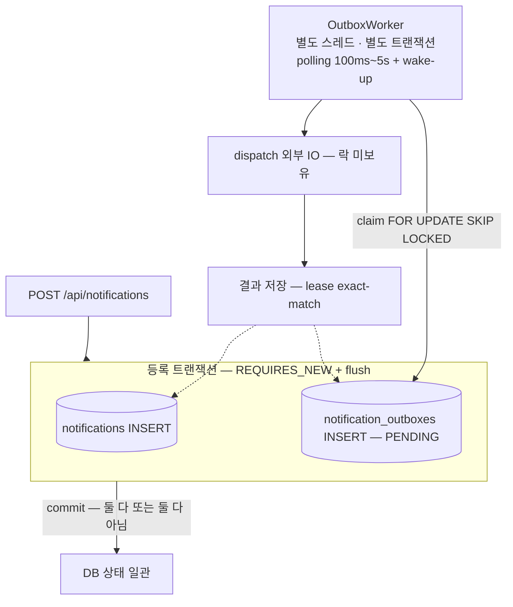
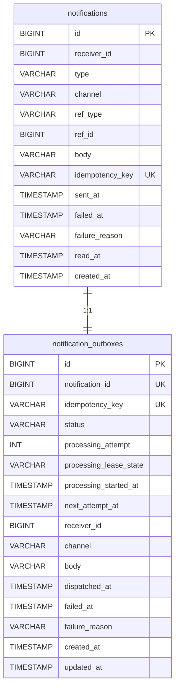
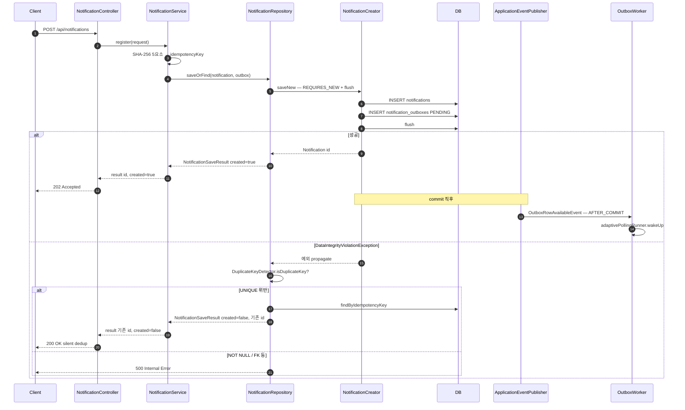
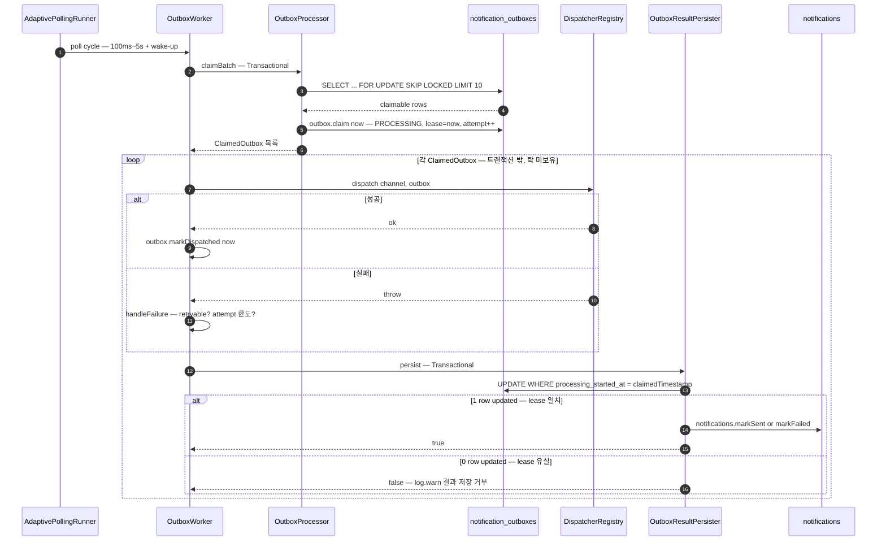

# 비동기 처리 구조 및 재시도 정책

명세 추가 제출물 *"비동기 처리 구조 및 재시도 정책 설명 문서"* 의 답. README *설계 결정과 이유* 의 상세판.

## 1. 개요 — 왜 outbox 패턴인가

명세 제약:
> 실제 메시지 브로커 설치 불필요. 단, 실제 운영 환경으로 전환 가능한 구조여야 함

브로커 없이 *비동기 발송* + *재시도* + *다중 인스턴스 안전* 을 모두 충족하려면 **DB 자체가 큐 역할** 을 해야 함. 이게 *transactional outbox 패턴*.



핵심 장점:
- **원자성** — 비즈니스 데이터와 *큐 메시지* 가 같은 트랜잭션. *발송 의도가 누락* 되는 일 없음
- **재시작 안전** — outbox 가 DB 라 서버 죽어도 다음 부팅 시 워커가 PENDING/RETRY_PENDING 자연 재처리
- **다중 인스턴스** — `FOR UPDATE SKIP LOCKED` 가 같은 행을 두 워커가 동시 claim 못 하게
- **운영 전환 가능** — `NotificationDispatcher` 인터페이스로 SMTP/SQS/Kafka 어댑터 교체만으로

---

## 2. 데이터 모델

### 2.1 두 테이블의 책임 분리

| 측면 | `notifications` | `notification_outboxes` |
| --- | --- | --- |
| 역할 | 사용자 가시 + 영구 결과 store | 워커 큐 + 라이프사이클 메타 |
| 보존 | 영구 (cleanup 안 함) | 종결 후 retention 만료 시 cleanup |
| 사용자 가시 | 조회 API 의 데이터 소스 | 미노출 |
| status 의미 | timestamp 로 derive (SENT/FAILED/PENDING) | 명시적 status 컬럼 (PENDING → PROCESSING → DISPATCHED/RETRY_PENDING/FAILED) |
| 결과 필드 | 영구 (`sent_at`, `failed_at`, `failure_reason`) | 휘발 (양쪽 dual-write, cleanup 시 사라짐) |
| 워커 메타 | — | `processing_attempt`, `processing_lease_state`, `processing_started_at`, `next_attempt_at` |
| 인덱스 | `(receiver_id, created_at, id)` | `(status, next_attempt_at, id)` |

dual-write 의미:
- `notifications` 는 *최종 결과만* 반영 (DISPATCHED / FAILED 종결 시점만). 사용자 가시 상태가 *깨끗하게* 유지됨
- `notification_outboxes` 는 *모든 status 전이* 추적. RETRY_PENDING 시도별 사유까지 휘발로 보유
- cleanup 후에도 `notifications` 의 사용자 가시 결과는 유지됨

### 2.2 ERD



ENUM 후보값 (mermaid 코멘트로 표현하면 GitHub 렌더가 깨지므로 본문에 분리):

| 컬럼 | 후보값 |
| --- | --- |
| `notifications.type` | `ENROLLMENT_COMPLETED`, `PAYMENT_CONFIRMED`, `COURSE_START_D1`, `ENROLLMENT_CANCELLED` |
| `notifications.channel`, `notification_outboxes.channel` | `EMAIL`, `IN_APP` |
| `notification_outboxes.status` | `PENDING`, `PROCESSING`, `DISPATCHED`, `RETRY_PENDING`, `FAILED` |
| `notification_outboxes.processing_lease_state` | `IDLE`, `CLAIMED` |

### 2.3 `notifications` DDL

```sql
CREATE TABLE notifications (
  id              BIGINT PRIMARY KEY AUTO_INCREMENT,
  receiver_id     BIGINT       NOT NULL,
  type            VARCHAR(64)  NOT NULL,
  channel         VARCHAR(16)  NOT NULL,
  ref_type        VARCHAR(64)  NOT NULL,
  ref_id          BIGINT       NOT NULL,
  body            VARCHAR(500) NOT NULL,
  idempotency_key VARCHAR(64)  NOT NULL,
  sent_at         TIMESTAMP    NULL,
  failed_at       TIMESTAMP    NULL,
  failure_reason  VARCHAR(500) NULL,
  read_at         TIMESTAMP    NULL,
  created_at      TIMESTAMP    NOT NULL,
  UNIQUE KEY uk_notifications_idem (idempotency_key),
  INDEX idx_notification_receiver_created (receiver_id, created_at, id)
);
```

| 인덱스 / 제약 | 목적 |
| --- | --- |
| `uk_notifications_idem` | 멱등성 보장 — race 결정자 |
| `idx_notification_receiver_created` | 사용자별 최신순 목록 조회 (`WHERE receiver_id=? ORDER BY created_at DESC, id DESC`) |

보존 정책: 영구. cleanup 대상이 아니다.

### 2.4 `notification_outboxes` DDL

```sql
CREATE TABLE notification_outboxes (
  id                     BIGINT PRIMARY KEY AUTO_INCREMENT,
  notification_id        BIGINT       NOT NULL,
  idempotency_key        VARCHAR(64)  NOT NULL,
  status                 VARCHAR(16)  NOT NULL,
  processing_attempt     INT          NOT NULL,
  processing_lease_state VARCHAR(16)  NOT NULL,
  processing_started_at  TIMESTAMP    NULL,
  next_attempt_at        TIMESTAMP    NULL,
  receiver_id            BIGINT       NOT NULL,
  channel                VARCHAR(16)  NOT NULL,
  body                   VARCHAR(500) NOT NULL,
  dispatched_at          TIMESTAMP    NULL,
  failed_at              TIMESTAMP    NULL,
  failure_reason         VARCHAR(500) NULL,
  created_at             TIMESTAMP    NOT NULL,
  updated_at             TIMESTAMP    NOT NULL,
  UNIQUE KEY uk_notification_outboxes_notification (notification_id),
  UNIQUE KEY uk_notification_outboxes_idem (idempotency_key),
  INDEX idx_outbox_status_next_attempt (status, next_attempt_at, id)
);
```

| 인덱스 / 제약 | 목적 |
| --- | --- |
| `uk_notification_outboxes_notification` | 1:1 매핑 보장 |
| `uk_notification_outboxes_idem` | 워커 시점 멱등성 보강 |
| `idx_outbox_status_next_attempt` | claim 쿼리 (`WHERE status IN ('PENDING','RETRY_PENDING') AND (next_attempt_at IS NULL OR next_attempt_at <= now) ORDER BY id ASC`) 최적화 |

dispatch 스냅샷 컬럼 (`receiver_id`, `channel`, `body`) 으로 워커 claim 쿼리가 `notifications` 와 join 하지 않는다.

보존 정책:

| status | retention |
| --- | --- |
| `DISPATCHED` | 7 일 |
| `FAILED` | 30 일 |

---

## 3. 등록 흐름



**핵심 디테일**:
- `@Transactional(REQUIRES_NEW)` — 자식 트랜잭션 분리. UNIQUE 위반 시 자식만 롤백, 부모 catch 가능
- `entityManager.flush()` — INSERT 를 메서드 *안에서* 발행. SEQUENCE id 전략으로 바뀌어도 catch 가 깨지지 않음
- 두 INSERT 가 *같은 자식 트랜잭션* — 어느 쪽 UNIQUE 가 깨지든 양쪽 롤백. 좀비 (notification 만 있고 outbox 없는) 상태 불가
- 상세 멱등성 패턴은 [`reason2.md`](reason2.md)

**Wake-up event**:
- `NotificationCreator` 의 commit 후 `OutboxRowAvailableEvent` 발행
- `OutboxWorker.onOutboxRowAvailable` (`@TransactionalEventListener(phase = AFTER_COMMIT)`) 가 수신 → `adaptivePollingRunner.wakeUp()` → 워커 즉시 깨움
- *등록 → 발송 latency 평균 100ms 이내*

---

## 4. 발송 흐름



**트랜잭션 경계 핵심**:
- *claim 트랜잭션* 과 *결과 저장 트랜잭션* 은 분리
- *외부 IO (dispatch)* 동안 *DB lock 보유 안 함*
- → 외부 IO 가 오래 걸려도 다른 워커가 *다른 행* 을 처리할 수 있음

---

## 5. 4중 동시성 방어

### 5.1 SKIP LOCKED — claim 단계

```sql
-- JpaNotificationOutboxRepository.findClaimableForUpdate
SELECT *
FROM notification_outboxes
WHERE status IN ('PENDING', 'RETRY_PENDING')
  AND (next_attempt_at IS NULL OR next_attempt_at <= :now)
ORDER BY id ASC
LIMIT :batchSize
FOR UPDATE SKIP LOCKED
```

- `FOR UPDATE` — 잡힌 행에 row-level lock
- `SKIP LOCKED` — 다른 워커가 lock 잡은 행은 *건너뜀*
- 결과: 다중 워커가 동시 polling 해도 *각자 다른 batch* 가져감

비유: 손님 줄 하나 + 창구 N 개. 손님이 *맨 앞만 잡으면* 창구 충돌. *맨 앞 → 그 다음 → ...* 으로 SKIP 하면 N 창구가 N 손님 처리.

### 5.2 Lease exact-match — 결과 저장 단계

claim 후 dispatch 가 오래 걸리는 동안 *timeout recovery* 가 그 행을 풀어줄 수 있음. 그러면 *다른 워커가 재claim*. 원래 워커가 늦게 깨어나 결과 저장하면 *다른 워커의 처리를 덮어쓰는 race*.

```sql
-- JpaNotificationOutboxRepository.updateIfLeaseMatched
UPDATE notification_outboxes
SET status = :status, ..., updated_at = :updatedAt
WHERE id = :id
  AND status = 'PROCESSING'
  AND processing_lease_state = 'CLAIMED'
  AND processing_started_at = :claimedProcessingStartedAt   -- ★ 핵심
```

- claim 시점의 `processing_started_at` 을 `ClaimedOutbox` 에 *고정 저장*
- 결과 저장 시 WHERE 절로 *내가 claim 했던 timestamp* 와 일치 확인
- 다른 워커가 재claim 했으면 timestamp 가 다름 → **0 행 갱신** → 결과 거부

코드:
```java
// OutboxResultPersister
@Transactional
public boolean persist(NotificationOutbox outbox, LocalDateTime claimedProcessingStartedAt) {
    boolean savedOutbox = notificationOutboxRepository.saveIfLeaseMatched(outbox, claimedProcessingStartedAt);
    if (!savedOutbox) {
        return false;   // lease 유실 — 결과 저장 거부
    }
    applyToNotification(outbox);
    return true;
}
```

→ dispatcher 가 이미 SMTP 호출했더라도 *상태 일관성* 은 유지 (외부 IO 의 중복 발송 자체는 *at-least-once* 의 본질적 한계).

### 5.3 Timeout recovery — 고착 행 복구

```java
// OutboxTimeoutRecoveryWorker
@Scheduled(fixedDelayString = "${outbox.recovery.fixed-delay-ms}")   // 30s
@Transactional
public void recoverStuckRows() {
    LocalDateTime cutoff = now.minus(Duration.ofMillis(leaseTimeoutMs));   // 60s
    List<NotificationOutbox> stuck = ...findRecoverableForUpdate(cutoff, batchSize);
    for (NotificationOutbox outbox : stuck) {
        recoverOne(outbox, now);
    }
}
```

- 60s 넘게 `status=PROCESSING` 인 행을 lease 유실로 간주
- `attempt < max` → `RETRY_PENDING` + 백오프 delay
- `attempt >= max` → `FAILED` + `failure_reason = "lease timeout (started at ...)"`
- `notifications.markFailed` 도 같이 갱신

→ 워커 crash / GC pause / 네트워크 hang 모두 자연 복구.

### 5.4 Retention cleanup

```java
// OutboxCleanupScheduler
@Scheduled(fixedDelayString = "${outbox.cleanup.fixed-delay-ms}")             // 1h
public void cleanup() {
    LocalDateTime dispatchedCutoff = now.minusDays(dispatchedRetentionDays);  // 7d
    int dispatchedDeleted = ...deleteDispatchedOlderThan(dispatchedCutoff, batchSize);   // 500/batch

    LocalDateTime failedCutoff = now.minusDays(failedRetentionDays);          // 30d
    int failedDeleted = ...deleteFailedOlderThan(failedCutoff, batchSize);
}
```

`notification_outboxes` 만 cleanup. `notifications` 는 영구. 사용자 가시 결과는 cleanup 후에도 유지.

---

## 6. 재시도 정책

### 분류 — `RetryExceptionClassifier`

```java
private boolean isRetryable(Throwable cause) {
    return cause instanceof TransientFailureException
            || cause instanceof IOException
            || cause instanceof TimeoutException;
}
```

| 예외 | 분류 | 결말 |
| --- | --- | --- |
| `IOException` (SMTP 연결 / 네트워크 hang) | retryable | RETRY_PENDING + delay |
| `TimeoutException` | retryable | RETRY_PENDING + delay |
| `TransientFailureException` (테스트 marker) | retryable | RETRY_PENDING + delay |
| `IllegalArgumentException` (잘못된 수신자 등) | non-retryable | 즉시 FAILED |
| `IllegalStateException` (invariant 위반) | non-retryable | 즉시 FAILED |
| 그 외 모든 Exception | non-retryable | 즉시 FAILED |

### 3 분기 — `OutboxProcessor.handleFailure`

```java
private void handleFailure(NotificationOutbox outbox, Throwable cause) {
    LocalDateTime now = LocalDateTime.now(clock);
    Classification classification = retryExceptionClassifier.classify(cause);

    // ① non-retryable → 즉시 영구 실패
    if (classification == NON_RETRYABLE) {
        outbox.markFailed(now, FailureReasons.fromException(cause));
        log.warn("outbox {} dispatch 실패 (NON_RETRYABLE) → FAILED: {}", outbox.getId(), cause.toString());
        return;
    }

    // ② retryable + 한도 초과 → 영구 실패
    if (outbox.getProcessingAttempt() >= maxAttempts) {
        outbox.markFailed(now, FailureReasons.maxAttemptsExceeded(attempt, cause));
        log.warn("outbox {} dispatch 실패 (max attempts {}/{}) → FAILED: {}", ...);
        return;
    }

    // ③ retryable + 한도 내 → 재시도 예약
    Duration delay = retryBackoffCalculator.nextDelay(attempt);
    outbox.markRetryPending(now, FailureReasons.fromException(cause), now.plus(delay));
    log.warn("outbox {} dispatch 실패 (attempt {}/{}) → RETRY_PENDING in {}ms: {}", ...);
}
```

### Exponential Backoff — `RetryBackoffCalculator`

| 파라미터 | 기본값 |
| --- | --- |
| max attempts | 5 |
| base delay | 5 s |
| multiplier | 2 |
| max delay | 5 min |
| jitter ratio | ±20 % |

```
delay(attempt) = min(base × 2^(attempt-1), max) × (1 ± jitter)

attempt 1: 5s   × jitter ≈ 4~6s
attempt 2: 10s  ≈ 8~12s
attempt 3: 20s  ≈ 16~24s
attempt 4: 40s  ≈ 32~48s
attempt 5: 80s  ≈ 64~96s (또는 max 5min 제한)
```

`outbox.next_attempt_at = now + delay`. claim 쿼리의 `WHERE (next_attempt_at IS NULL OR next_attempt_at <= :now)` 가 *backoff 만료 행만* 잡아옴.

---

## 7. Polling — Adaptive + Wake-up

### Adaptive

| 파라미터 | 값 | 근거 |
| --- | --- | --- |
| min delay | 100 ms | 작업 폭주 시 거의 즉시 다음 batch claim |
| max delay | 5 s | 작업 없을 때 휴식 한도. wake-up event 실패 시에도 5초 안에 자연 회복 |
| 알고리즘 | 2 배수 지수 backoff, `[min, max]` 로 clamp | 100 → 200 → 400 → ... → 5000 |
| jitter | ±20% | 다중 인스턴스에서 같은 시점 동시 polling 방지 |

작업이 있을 때 (`PollingHint.HAS_WORK`) 다시 min 으로 reset. 없을 때 (`PollingHint.IDLE`) 점진 backoff.

### Wake-up Event

```java
@TransactionalEventListener(phase = TransactionPhase.AFTER_COMMIT)
public void onOutboxRowAvailable(OutboxRowAvailableEvent event) {
    adaptivePollingRunner.wakeUp();
}
```

- `NotificationCreator.saveNew` commit 후 발행
- 워커가 *현재 sleep 중이어도 즉시 깨움*
- 다중 인스턴스에서 *본인 프로세스 내부 이벤트만* 깨움. 다른 인스턴스는 polling 으로 자연 잡음 (안전)

### SmartLifecycle

```java
@Override
public synchronized void start() {
    Thread thread = new Thread(this::runLoop, "outbox-worker");
    thread.setDaemon(true);
    workerThread = thread;
    thread.start();
    log.info("OutboxWorker 시작 — auto-start={}", outboxWorkerProperties.autoStart());
}

@Override
public synchronized void stop() {
    running = false;
    adaptivePollingRunner.wakeUp();   // sleep 중인 워커 즉시 깨워서 종료 인지
    workerThread.join(5_000);
    log.info("OutboxWorker 종료");
}
```

- Spring shutdown 시 graceful — 진행 중 cycle 끝나고 종료
- 새 claim 안 함, 진행 중 dispatch 는 마무리 후 종료

---

## 8. 운영 시나리오 — 명세 필수 5번 직접 답변

### 8.1 처리 중 상태 지속 → 복구

> "처리 중 상태가 일정 시간 이상 지속되는 경우 복구 방법을 설계하세요."

**답**: `OutboxTimeoutRecoveryWorker` (`@Scheduled fixedDelay 30s`) 가 `processing_started_at < now - 60s` 인 행을 RETRY_PENDING / FAILED 로 복구. 5.3 참조.

**시연**: 워커가 dispatch 중 강제 kill → 60초 후 recovery worker 가 해당 outbox 의 status 를 RETRY_PENDING 으로 변경 → 다음 polling 사이클에서 다른 워커 (또는 같은 워커) 가 잡아 재처리.

### 8.2 서버 재시작 후 미처리 알림 유실 X

> "서버 재시작 후에도 미처리 알림이 유실 없이 재처리되어야 합니다."

**답**: outbox 가 DB 라 서버 재시작 후에도 PENDING / RETRY_PENDING 행이 그대로 남아 있음. 부팅 후 워커가 polling 으로 자연 재처리. `OutboxWorker.start()` 가 `SmartLifecycle` 의 isAutoStartup 으로 부팅 시 자동 가동.

**시연**:
```bash
# 1. 알림 등록 (워커가 dispatch 시작하기 전)
curl -X POST ...

# 2. 즉시 강제 종료
docker compose kill app

# 3. 다시 부팅
docker compose start app

# 4. 로그에서 [EMAIL] outboxId=N 가 부팅 후에 떠 있음 확인
docker compose logs app | grep '\[EMAIL\]'
```

### 8.3 다중 인스턴스에서 중복 처리 X

> "다중 인스턴스 환경에서도 동일 알림이 중복 처리되어서는 안 됩니다."

**답**: 5.1 (SKIP LOCKED) + 5.2 (lease exact-match) 두 단계 방어. 9 시연 결과 참조.

---

## 9. 다중 인스턴스 시연 결과

`docker compose up --scale app=2 -d --build` 로 app 2 인스턴스 + 공유 mysql 1 인스턴스 부팅. 20 개 알림 POST 시뮬레이션.

### 시연 로그 (실제 캡처)

```
notifier-app-1 | OutboxWorker 시작 — auto-start=true
notifier-app-2 | OutboxWorker 시작 — auto-start=true
notifier-app-1 | Started NotifierApplication in 2.476 seconds
notifier-app-2 | Started NotifierApplication in 2.478 seconds

# 20개 POST 후
notifier-app-1 | [EMAIL] outboxId=3  receiver=1 body=...
notifier-app-1 | [EMAIL] outboxId=2  receiver=1 body=...
notifier-app-1 | [EMAIL] outboxId=4  receiver=1 body=...
notifier-app-1 | [EMAIL] outboxId=5  receiver=1 body=...
notifier-app-1 | [EMAIL] outboxId=6  receiver=1 body=...
notifier-app-1 | [EMAIL] outboxId=7  receiver=1 body=...
notifier-app-1 | [EMAIL] outboxId=8  receiver=1 body=...
notifier-app-1 | [EMAIL] outboxId=9  receiver=1 body=...
notifier-app-1 | [EMAIL] outboxId=10 receiver=1 body=...
notifier-app-1 | [EMAIL] outboxId=11 receiver=1 body=...
notifier-app-2 | [EMAIL] outboxId=12 receiver=1 body=...   ← app-2 끼어듦
notifier-app-2 | [EMAIL] outboxId=13 receiver=1 body=...
notifier-app-2 | [EMAIL] outboxId=14 receiver=1 body=...
notifier-app-2 | [EMAIL] outboxId=15 receiver=1 body=...
notifier-app-1 | [EMAIL] outboxId=16 receiver=1 body=...
notifier-app-1 | [EMAIL] outboxId=17 receiver=1 body=...
notifier-app-1 | [EMAIL] outboxId=18 receiver=1 body=...
notifier-app-1 | [EMAIL] outboxId=19 receiver=1 body=...
notifier-app-1 | [EMAIL] outboxId=20 receiver=1 body=...
notifier-app-1 | [EMAIL] outboxId=21 receiver=1 body=...
```

### 자동 검증

```bash
docker compose logs app 2>&1 | grep '\[EMAIL\]\|\[IN_APP\]' \
  | grep -oE 'outboxId=[0-9]+' | sort | uniq -d
# 빈 출력 = 중복 dispatch 0건
```

### 해석

- ✅ **21 개 모두 처리됨** (outboxId 1~21)
- ✅ **각 outboxId 가 한 번씩만 등장** = 중복 dispatch 0
- ✅ **양쪽 인스턴스가 모두 dispatch** = 다중 인스턴스 환경 정상 동작
- 처리 비율 (app-1 : app-2 = 17 : 4) 은 *우연* — POST 가 호스트 8080 (= app-1) 으로만 들어왔고 wake-up event 가 app-1 만 깨움. app-2 는 polling 으로 *그 사이 lock 잡힌 행들을 SKIP* 한 뒤 *그 다음 행* 일부를 잡음. **race 보호가 정확히 동작한 증거**

→ 명세 필수 5번 의 *"다중 인스턴스 환경에서도 동일 알림이 중복 처리되어서는 안 됩니다"* **실시간 시각 증명**.

---

## 10. 외부화 설정

`application-local.yaml` / `application.yaml` 의 `outbox.*` 키. `@ConfigurationProperties` 로 강타입 바인딩 ([`global/config/Outbox*Properties.java`](../src/main/java/com/hyso/notifier/global/config/)).

| 키 | 기본값 | 의미 |
| --- | --- | --- |
| `outbox.scheduling.enabled` | true | @Scheduled (recovery + cleanup) 활성화 |
| `outbox.worker.auto-start` | true | 부팅 시 OutboxWorker 자동 가동 |
| `outbox.worker.batch-size` | 10 | claim 한 사이클 행 수 |
| `outbox.worker.poll-min-delay-ms` | 100 | adaptive polling 하한 |
| `outbox.worker.poll-max-delay-ms` | 5000 | adaptive polling 상한 |
| `outbox.worker.poll-multiplier` | 2 | 지수 backoff 배수 |
| `outbox.worker.poll-jitter-ratio` | 0.2 | ±20% |
| `outbox.retry.max-attempts` | 5 | dispatch 시도 한도 |
| `outbox.retry.base-delay-ms` | 5000 | 첫 재시도 delay |
| `outbox.retry.multiplier` | 2 | 지수 배수 |
| `outbox.retry.max-delay-ms` | 300000 | 5 min |
| `outbox.retry.jitter-ratio` | 0.2 | ±20% |
| `outbox.recovery.lease-timeout-ms` | 60000 | 60 s |
| `outbox.recovery.fixed-delay-ms` | 30000 | recovery 사이클 주기 |
| `outbox.recovery.batch-size` | 100 | recovery 한 사이클 행 수 |
| `outbox.cleanup.dispatched-retention-days` | 7 | DISPATCHED 보관 일수 |
| `outbox.cleanup.failed-retention-days` | 30 | FAILED 보관 일수 |
| `outbox.cleanup.fixed-delay-ms` | 3600000 | cleanup 사이클 주기 (1h) |
| `outbox.cleanup.batch-size` | 500 | cleanup 한 사이클 DELETE 행 수 |

운영 환경에서 부하 / 장애 특성에 따라 조정 가능. *코드 변경 없이* application properties 만으로.

---

## 참고

- [`../README.md`](../README.md) — 프로젝트 개요 (9 섹션)
- [`requirements-and-improvements.md`](requirements-and-improvements.md) — **추가 제출물 ②**: 요구사항 해석 + 가정 + 개선 의견 (phase 기반)
- [`reason.md`](reason.md) — inbox 미적용 deep dive
- [`reason2.md`](reason2.md) — 멱등성 패턴 deep dive (try saveNew + catch + REQUIRES_NEW + flush)
- [`testing-strategy.md`](testing-strategy.md) — 통합 테스트 전략
